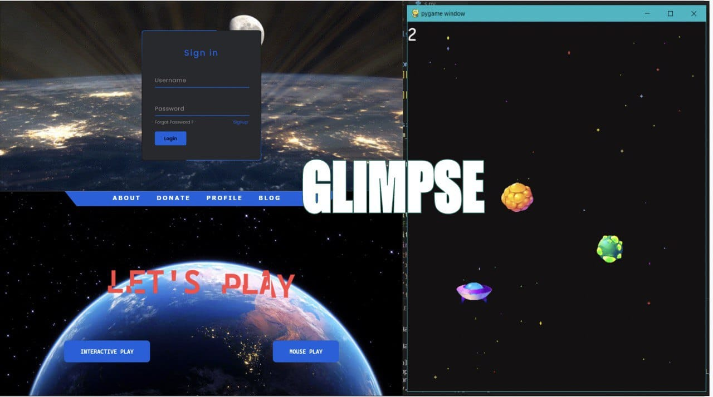

# Fruit-Ninja with Vision
A clone of the game Fruit Ninja using PyGame but something different you can this game by moving your head. I am not kiding ! 😍


To run this game install the individual python modules given in requirements.txt file using pip.

You can run this game using the following command on your command prompt or terminal, depending on the version of python installed.
```
1. python game.py
2. python3 game.py
3. py game.py
```
## Live Video 

https://youtube.com/shorts/aibgwjWSqFQ

You only have to move your head over the fruit to cut it. Should have an average camera so that face can be located. Have to face front your face should not be hidden 

A PLATFORM THAT UTILIZES FACIAL RECOGNITION AND EYE TRACKING TO IMPROVE AIM TRAINING FOR PLAYERS .



### For Run this project
In any IDE of your's run game.py first
```
python game.py
```

Open a new terminal and run eyeball.py second
```
python eye_ball.py
```
### This will need 2 terminals
``` 
Because of pygame and cv2 they both are not run in the terminal
when both are running
```
### you can play game without touching your keyborad or mouse
